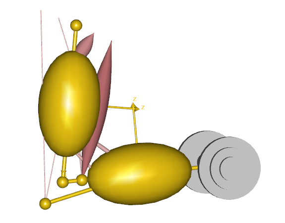
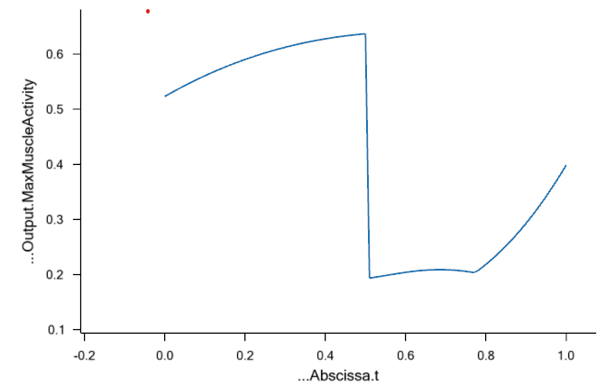

# Time dependent contact example

Example model of how to model a contact between two objects that switch off during the
simulation.

The model consists of a simple 2D arm model with eight muscles. Furthermore, it contains a
dumbbell segment that is attached to the hand node of the arm.



The simulation performs a arm curl where the effect of the dumbbell is switched off
halfway through the simulation.

To achieve this we have defined a set of contact muscles between the hand node and the
dumbbell. These are reqruited when the dumbbell is simulated to be attached to the hand.
Likewise, we have defined a similar set of contact muscles that are reqruited when the
dumbbell is simulated to be out of the hand.

This is done by defining a `AnyMuscleModelUsr1` that can define the strength parameter as
a function. In this case we use an interpolation function to determine when the dumbbell
switches from being carried by the hand or by the "world".

```
AnyMuscleModelUsr1 ContactMuscleModel=   {
    F0 = 0.000000;
    S = .StrengthFunction.Data[...ArmModelStudy.iStep][...ArmModelStudy.iStep] * 1000;
};
```

Run the Inverse dynamics simulation and inspect the MaxMuscleactivity to see how it drops
when the dumbbell is out of contact with the hand.


